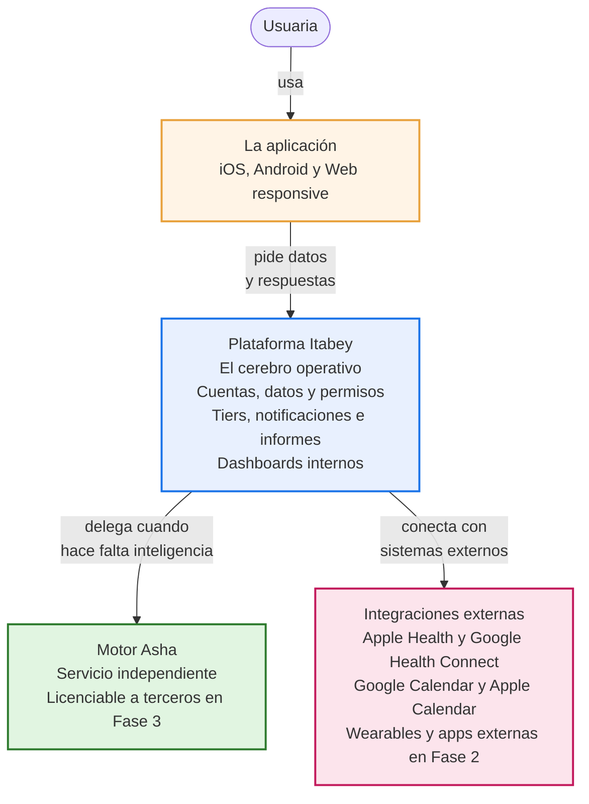
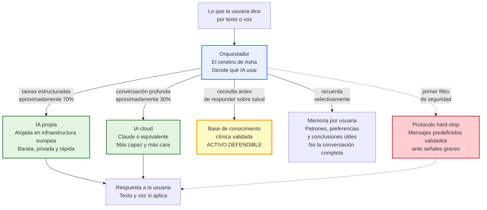

# Itabey / Asha — Arquitectura del sistema: resumen ejecutivo

**Fecha:** 2026-05-30
**De:** Alex Santolaria — Consultor Técnico
**Para:** Mariela Herrera Gil — Polymita Systems SL
**Propósito:** Que te hagas una idea clara de cómo se va a construir Itabey/Asha técnicamente, **sin tecnicismos**, suficiente para que puedas explicarlo a inversores y entender por qué ciertas decisiones técnicas son también decisiones de negocio.

> Existe una versión detallada de este documento (`arquitectura-preliminar.md`) con el detalle técnico para el equipo y los proveedores. Este resumen ejecutivo es el equivalente en lenguaje accesible.

---

## 1. Por qué la arquitectura importa para Itabey

La arquitectura es la forma en que se organizan internamente las piezas del producto. No es un detalle técnico secundario: **determina cuánto cuesta operar el producto, cómo escala, qué se puede licenciar, qué resistencia tendrás frente a cambios de proveedores y cuán flexible serás para adaptar tiers comerciales en el futuro**.

Tres ideas que conviene retener para conversaciones con inversores:

- **Asha no es la app**. Asha es un motor de inteligencia artificial independiente que la app usa, y que en el futuro podrás licenciar a terceros sin tocar nada más.
- **No se usa "una IA" sino varias**. Una arquitectura que combina inteligencia artificial propia (barata, privada) con inteligencia artificial cloud (más capaz, más cara) baja el coste por usuaria entre 3 y 5 veces respecto a una arquitectura que usa solo cloud.
- **Modular significa flexible**. La capacidad de activar y desactivar funcionalidades por tier sin tocar código es lo que permite que el producto sea a la vez gratuito para algunas, premium para otras, y B2B corporativo para empresas, sin construir productos paralelos.

---

## 2. Las cuatro piezas del sistema

El sistema se divide en cuatro piezas con responsabilidades claras y separadas. Cada pieza habla con las demás a través de canales bien definidos.

### La aplicación (la app que usa la usuaria)

Es lo que la usuaria ve y toca: la app móvil en su iPhone o Android, y la versión web. Aquí viven el calendario, los paneles, los formularios de registro, la conversación con Asha y todas las pantallas.

La app no toma decisiones inteligentes ni guarda los datos definitivos: solo presenta información, captura entradas y le pide a la plataforma lo que necesita.

### La plataforma Itabey (el cerebro operativo)

Es el corazón del sistema, lo que la usuaria no ve directamente pero está siempre operando detrás. Aquí viven:

- Las cuentas, las contraseñas y los permisos.
- Los datos de cada usuaria (ciclo, síntomas, sueño, eventos vitales).
- El sistema de tiers (free, premium, B2B) y los mecanismos para activar y desactivar funcionalidades.
- Las notificaciones, los informes que se generan, las integraciones con calendarios y wearables.
- Los dashboards internos del equipo (admin, equipo clínico, etc.).

### El motor Asha (la inteligencia conversacional)

**Aquí está el activo defendible.** Asha es un servicio independiente que se comunica con la plataforma Itabey, pero podría funcionar por sí solo, conectado a otras plataformas. Esto se hace así porque:

- En el futuro queremos poder **licenciar Asha** a clínicas, aseguradoras o plataformas de salud, sin tocar la app Itabey.
- Si Asha crece o el consumo aumenta, podemos **escalarla por separado** sin afectar al resto del sistema.
- Si en el futuro queremos cambiar de proveedor de inteligencia artificial, podemos hacerlo **sin rediseñar la plataforma**.

### Las integraciones externas (los puentes con otras herramientas)

Es la pieza que habla con sistemas de fuera: Apple Health, Google Health Connect, Google Calendar, Apple Calendar y, más adelante, wearables avanzados y apps externas complementarias.

---

## 3. Cómo funciona Asha por dentro (lo conceptual)

El motor Asha tiene varias sub-piezas. Conviene entender la lógica conceptual porque es la que explica los costes y la defensibilidad del activo.

### El orquestador (el cerebro de Asha)

Cada vez que la usuaria interactúa con Asha, hay un componente interno —el orquestador— que toma una decisión muy importante: **qué tipo de inteligencia artificial usar para esta tarea concreta**. No es lo mismo decidir si una frase es "registro de síntoma" o "consulta sobre salud" (algo simple) que generar una respuesta empática y profunda sobre el sueño de la usuaria (algo complejo).

Un buen orquestador es lo que permite que Asha funcione bien a coste razonable. Un mal orquestador (uno que use siempre la IA más cara) puede multiplicar el coste por 5.

### Mix híbrido: dos tipos de IA combinadas

Asha utiliza dos tipos de inteligencia artificial en paralelo:

- **Inteligencia artificial propia** (alojada en nuestra propia infraestructura europea). Es barata, privada y rápida. Se usa para tareas estructuradas: clasificar lo que dice la usuaria, extraer datos como "dolor de cabeza" o "mala calidad de sueño", hacer búsquedas en la base de conocimiento. **Aproximadamente el 70% del tráfico va por aquí.**
- **Inteligencia artificial cloud** (Claude de Anthropic, o equivalente). Es más capaz, más cara y se accede vía servicio externo. Se usa para conversaciones profundas, respuestas empáticas, generación de informes médicos. **Aproximadamente el 30% del tráfico va por aquí.**

La proporción 70/30 es lo que hace viable el coste del producto. Si lo hiciéramos todo por la IA cloud cara, el coste por usuaria se multiplicaría por 3-5.

### La base de conocimiento clínica (el activo defendible)

Asha no responde a partir de "lo que sabe" por sí sola. Antes de responder cualquier cosa sobre salud, **consulta una base de conocimiento clínica validada y versionada por el equipo médico** de Itabey. Esa base contiene:

- Las cápsulas educativas aprobadas por el equipo clínico.
- Los protocolos de seguridad y derivación (qué hacer ante señales de riesgo).
- Los criterios biomédicos generales validados.

**Esta base de conocimiento es el activo más defendible del producto.** Nadie más la tiene; se ha construido específicamente para Itabey con tu equipo clínico; está versionada y es actualizable. Es lo que permite que Asha responda con rigor, no con inventos, y lo que la diferencia de cualquier chatbot genérico.

### La memoria por usuaria (selectiva, no completa)

Asha recuerda patrones, preferencias y conclusiones útiles de cada usuaria, no la conversación entera. Esto es importante por dos razones: por privacidad (no almacenamos cosas que no necesitamos) y por coste (más memoria = más coste por mensaje). La usuaria puede inspeccionar, editar y borrar lo que Asha recuerda sobre ella.

### Voz

Asha entiende lo que la usuaria dice por voz (mediante un componente llamado Whisper, alojado en nuestra infraestructura) y le responde en voz natural (mediante un servicio cloud de alta calidad). La calidad de voz es importante porque es parte de la experiencia diferencial: la usuaria puede registrar su día caminando, conduciendo o cocinando.

---

## 4. Cinco decisiones clave de arquitectura y qué significan para Itabey

| Decisión técnica                                         | Qué significa para el negocio                                                                                                                                                                           |
| -------------------------------------------------------- | ------------------------------------------------------------------------------------------------------------------------------------------------------------------------------------------------------- |
| **Asha es un servicio independiente desde el día 1**     | Podrás licenciar Asha a terceros en Fase 3 sin tener que rediseñar nada. Es la base técnica de la futura línea de ingresos por licenciamiento.                                                          |
| **Mix híbrido (IA propia + IA cloud)**                   | Coste por usuaria 3-5 veces menor que el de un competidor "solo cloud" + resistencia a la subida estructural prevista del coste de IA en los próximos años. **Es una decisión financiera, no técnica.** |
| **Capacidad de cambiar de proveedor de IA sin rediseño** | Si Anthropic, OpenAI o Google suben precios o cierran servicios, podremos cambiar sin esfuerzo. Negociamos mejor porque nadie nos tiene atrapados.                                                      |
| **Modularidad y tiers desde el día 1**                   | El mismo sistema sirve para gratis, premium individual y B2B corporativo. No construimos productos paralelos. Podemos definir contenidos de cada tier con datos reales sin obras técnicas.              |
| **Cloud europeo + preparación para HIPAA**               | Cumplimiento RGPD pleno + preparación para que el mercado prioritario EE. UU. hispano sea viable regulatoriamente.                                                                                      |

---

## 5. La conversación incómoda: la evolución del coste de IA

Cuatro hechos que dicen las fuentes sectoriales (Moody's, Goldman Sachs, Gartner, Epoch AI):

1. **El precio de operar una conversación con IA está bajando** (los precios por unidad han caído 10 veces en 2 años; Gartner predice -90% para 2030).
2. **Pero la factura mensual sube** porque las aplicaciones consumen más por usuaria (más memoria, más interacciones, más capacidades) conforme maduran.
3. **Los precios actuales están subsidiados** por capital riesgo: OpenAI pierde 1,35 dólares por cada dólar que ingresa. Cuando esa política termine (12-24 meses), habrá una subida.
4. **Hay un cuello de botella físico**: la electricidad y los chips para data centers de IA están saturados, y eso encarece tanto al cloud comercial como a quien tiene infraestructura propia.

**Conclusión clara**: el coste neto de operar IA va a subir en términos netos. La pregunta no es si subirá sino cuánto. Y la respuesta depende casi enteramente de la arquitectura:

| Escenario a 2-4 años                                                        | Subida del coste IA respecto al actual |
| --------------------------------------------------------------------------- | -------------------------------------- |
| **Subida controlada** (arquitectura modular bien ejecutada)                 | +50% a +100%                           |
| **Subida intensa** (normalización dura + uso agresivo de modelos avanzados) | +200% a +400%                          |
| **Subida descontrolada** (arquitectura monolítica solo cloud)               | +400% a +700%+                         |

**No es el mercado lo que decide en cuál de los tres escenarios cae Itabey: es la decisión arquitectónica.** Por eso esta propuesta insiste tanto en el mix híbrido y en la capacidad de switch entre proveedores.

**Implicación financiera concreta**: conviene reservar dentro de la ronda seed un colchón equivalente a 12-24 meses del coste de IA previsto para el escenario base (estimado en ~150.000-300.000 €), además del colchón general. Tres opciones que te he detallado en email aparte (A: mantener ronda, B: ampliar 200-400K específicamente para colchón IA, C: pricing absorbente desde día 1). La decisión es tuya.

---

## 6. Lo que NO decide este documento

Conviene tenerlo claro al hablar con inversores y proveedores:

- **No fija el stack tecnológico concreto** (qué lenguaje de programación, qué herramientas exactas, qué proveedor cloud). Lo decide el proveedor desarrollador en su propuesta.
- **No fija qué modelo de IA concreto se usa** (Claude vs GPT vs Gemini vs open-source específico). Lo decide el proveedor.
- **No fija las versiones específicas de las herramientas**.
- **No es la arquitectura final** — es una propuesta del consultor para servir de **referencia y benchmark** al comparar propuestas de proveedores.

**Qué hacer con las propuestas que lleguen:**

- Si una propuesta encaja en términos generales con este esquema, es buena señal.
- Si una propuesta se desvía mucho (todo cloud sin IA propia, sistema monolítico sin Asha desacoplada, sin capacidad de switch entre proveedores), conviene preguntar el porqué antes de descartarla.
- Los criterios del PRD § 11 son los que determinan la evaluación final.
